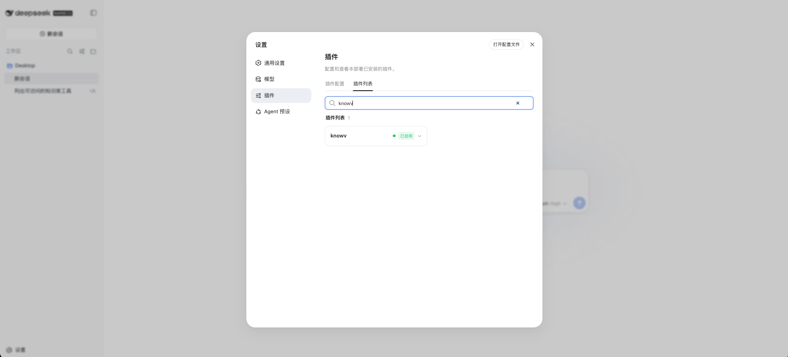
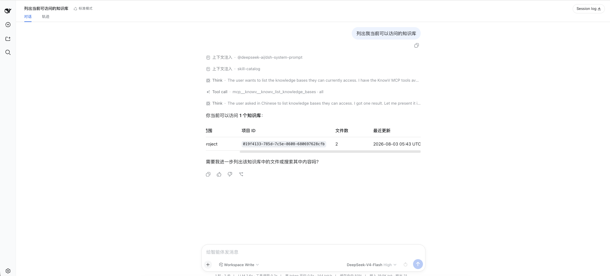
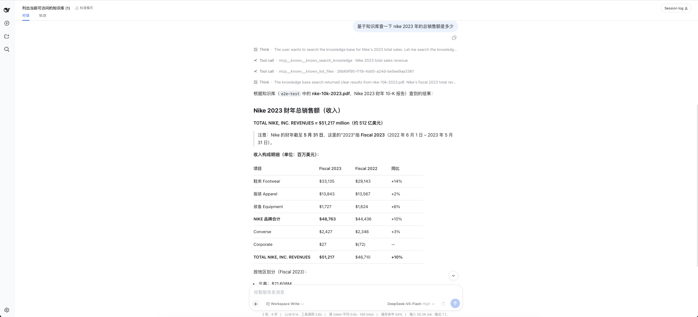

# KnowV Plugin for DeepSeek Harness

这个插件把 KnowV 企业知识能力接入 DeepSeek Harness。安装并配置后，你可以直接在 Harness 对话中查询自己有权限访问的知识库和文件。

本插件面向 KnowV SaaS 用户，固定连接 KnowV 官方服务：

```text
https://console.knowvai.com/mcp
```

不需要部署服务器，也不要填写其他 MCP 地址。

## 开始前

- 已安装 DeepSeek Harness `0.1.0-rc.6` 或更高版本。
- 已安装 Node.js 22.19+ 和 pnpm 11+，并确保 `pnpm` 在 PATH 中。
- 已有 KnowV 账号，并能登录 [KnowV 控制台](https://console.knowvai.com/)。

## 1. 安装插件

在终端执行：

```bash
npx --yes @deepseek-ai/dsh@0.1.0-rc.6 \
  plugin --profile web add github:knowvai/dsh-plugin
```

## 2. 创建 KnowV API Key

打开 [API Key 管理页面](https://console.knowvai.com/manager-api-key)，登录后创建一个 API Key，并复制完整内容。

API Key 的权限由它所属的 KnowV 账号和租户决定。Harness 中不能通过参数切换到其他租户；如果需要访问其他租户，请使用对应租户下创建的 API Key。

## 3. 配置环境变量

必须在启动 DeepSeek Harness 的同一个终端中设置以下变量：

```bash
export KNOWV_MCP_SERVER_URL="https://console.knowvai.com/mcp"
export KNOWV_MCP_API_KEY="粘贴你刚创建的 API Key"
```

然后从这个终端启动 Harness：

```bash
npx --yes @deepseek-ai/dsh@0.1.0-rc.6 --profile web
```

如果 Harness 已经在运行，请先退出，再用设置好环境变量的终端重新启动。直接从桌面图标启动的 Harness 通常不会读取你终端里的环境变量。

## 4. 检查是否配置成功

打开 Harness 的“设置 → 插件”，插件列表中应看到 `knowv`。

在“插件列表”中搜索 `knowv`，状态应显示为“已启用”：



新建一个对话，尝试发送：

- “列出我可以访问的知识库。”
- “列出知识库中的文件。”
- “读取这个文件的元数据。”
- “在 KnowV 中搜索与……相关的内容。”

结果只会包含当前 API Key 有权限访问的知识和文件。

例如，让 Harness 列出当前账号可访问的知识库时，可以看到实际调用的 KnowV 工具和返回结果：



还可以直接针对知识库中的文档提问，Harness 会调用 KnowV 检索并基于命中的内容回答：



## 更新插件

先移除旧版本，再安装最新版本：

```bash
npx --yes @deepseek-ai/dsh@0.1.0-rc.6 \
  plugin --profile web remove @knowvai/knowv

npx --yes @deepseek-ai/dsh@0.1.0-rc.6 \
  plugin --profile web add github:knowvai/dsh-plugin
```

如果你安装的是更早版本，旧包名可能是 `@knowvai/dsh-plugin`；请先移除这个旧包，再执行上面的安装命令。

## 卸载插件

```bash
npx --yes @deepseek-ai/dsh@0.1.0-rc.6 \
  plugin --profile web remove @knowvai/knowv
```

卸载后重启 Harness 即可。

## 常见问题

### 提示 `pnpm not found on PATH`

请先按照 [pnpm 安装说明](https://pnpm.io/installation) 安装 pnpm，然后重新执行安装命令。

### 插件显示了，但对话中没有知识库工具

确认以下内容：

1. `KNOWV_MCP_SERVER_URL` 是否精确为 `https://console.knowvai.com/mcp`。
2. `KNOWV_MCP_API_KEY` 是否是刚从 [API Key 管理页面](https://console.knowvai.com/manager-api-key) 创建的完整 Key。
3. 环境变量是否在启动 Harness 的同一个终端中设置。
4. 设置变量后是否重新启动了 Harness。

### 插件列表仍显示旧名称

这通常表示旧版本仍在 profile 中。移除旧包 `@knowvai/dsh-plugin`（或 `@knowvai/dsh-mcp`），再重新安装本仓库，并重启 Harness。

## 安全提示

API Key 等同于你的 KnowV 访问凭证。不要把它提交到 Git、写入 README、截图或发送给他人；只通过环境变量配置。
